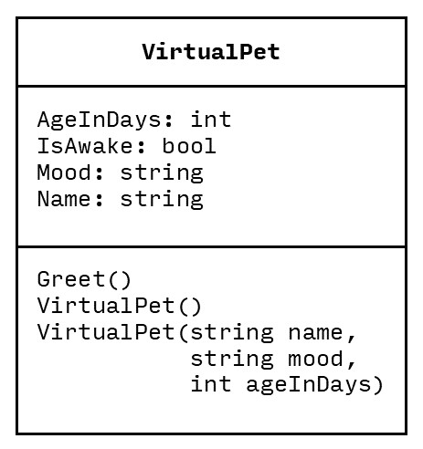
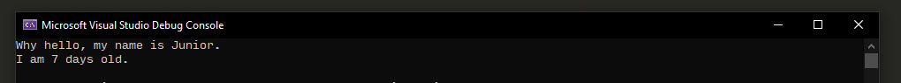
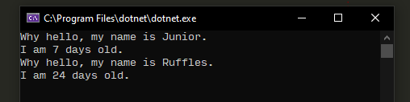

# Virtual Pet App Breakdown

## Overview

Create a virtual pet application that allows the player to create their own pet. Use this UML that roughly lines up from our demo in class:



## Objective

This assignment was developed for you to practice basic C# elements:

- Statements
- Data types
- String
- Classes
- Constructor
- Methods

## Instructions

It's important that you follow along and do this yourself. Type it out - don't copy and paste. You can't learn a language if you don't practice.

If you get lost, don't forget to go back to the slides from class or the code from class (see [module 2](https://canvas.colum.edu/courses/12926/modules#module_73078)).

### Project Setup

First, create a new project in Visual Studio and call it something like "VirtualPet".

Next, add a comment to the top of your project that includes the title of your app and any credits:

```cs
/*
 * VirtualPet by Your Name
 * Introduction to Programming, date
 * (If anyone helped you - classmate, peer, stack overflow - include an  attribution here!)
 */
```

### Creating the `VirtualPet` Class

Next, create a new class and name it "VirtualPet" (in the toolbar, click on "Project" and then click on "Add Class"). Add the properties and methods from the UML diagram. Your code might look something like this:

```cs
using static System.Console;

namespace VirtualPet
{
    class VirtualPet
    {
        public string Name;
        public string Mood;
        public int AgeInDays;
        public bool IsAwake = false;
    }
}
```

Some important points:
- These variables are called [fields](https://docs.microsoft.com/en-us/dotnet/csharp/programming-guide/classes-and-structs/fields) - they live inside of the `VirtualPet` class.
- The `public` keyword before the field is an [access modifier](https://docs.microsoft.com/en-us/dotnet/csharp/programming-guide/classes-and-structs/access-modifiers). It dictates where the field can be accessed. `public` means it can be accessed from anywhere in your codebase. `private` means it can only be accessed from within `VirtualPet`.
- `using static System.Console;` lets us use the Console class from the System [namespace](https://docs.microsoft.com/en-us/dotnet/csharp/programming-guide/namespaces/) without needing to prefix every line with `Console.` or `System.Console.` (e.g. `Title` instead of `Console.Title`). We're not using the console yet, but we will.

We've created a class (blueprint) for virtual pets, but we haven't created any instances (objects) from it yet. To do that, we turn back to `Program.cs`:

```cs
using static System.Console;

namespace VirtualPet
{
    class Program
    {
        static void Main(string[] args)
        {
            VirtualPet junior = new VirtualPet();
            junior.Name = "Junior";
            junior.AgeInDays = 7;
            WriteLine("Why hello, my name is " + junior.Name + ".");
            WriteLine("I am " + junior.AgeInDays + " days old.");

            ReadKey();
        }
    }
}
```

If you run it, you should see something like:



Now, use the same pattern and create a second virtual pet.

### Adding a Method

This isn't bad, but we're repeating ourselves. For each pet that we create, we have to write two lines of code to make it greet the player. To make things more efficient, we can move this code into a `Greet` [method](https://docs.microsoft.com/en-us/dotnet/csharp/programming-guide/classes-and-structs/methods) on the `VirtualPet` class:

```cs
using static System.Console;

namespace VirtualPet
{
    class VirtualPet
    {
        public string Name;
        public string Mood;
        public int AgeInDays;
        public bool IsAwake = false;

        public void Greet()
        {
            WriteLine("Why hello, my name is " + Name + ".");
            WriteLine("I am " + AgeInDays + " days old.");
        }
    }
}
```

Some important notes:
- When you are inside of a class, you can reference its fields by name (e.g. `Mood` or `IsAwake`).
- When we invoke `Greet` on a pet instance, it will have access to that pet's unique `Name` and `AgeInDays`.

Back in Program.cs, replace the `WriteLine` lines of code with `Greet()`:

```cs
VirtualPet junior = new VirtualPet();
junior.Name = "Junior";
junior.AgeInDays = 7;
junior.Greet();
```

Now you should have two pets that can run `Greet()` and we've saved ourselves some typing:



### Using Constructors

This way of creating a pet is tedious and requires us to reach into the `junior` object and set its fields manually. It's a best practice in programming to let a [constructor](https://docs.microsoft.com/en-us/dotnet/csharp/programming-guide/classes-and-structs/constructors) handle this. Constructors are special methods that get invoked when you create a new instance of a class (e.g. when you run `new VirtualPet()`).

Back in VirtualPets.cs, add two constructors within the `VirtualPet` class:

```cs
public VirtualPet()
{
    Name = "Unknown";
    Mood = "Unknown";
    AgeInDays = 0;
}

public VirtualPet(string name, string mood, int ageInDays)
{
    Name = name;
    Mood = mood;
    AgeInDays = ageInDays;
}
```

Some important notes:
- The first constructor lets us create a `VirtualPet` instance without providing any parameters. This will just fill in some default values.
- The second constructor lets us create a `VirtualPet` instance and initialize some of the pet's fields all at once.

Then back in Program.cs, let's refactor our code. Refactoring is the process of restructuring your code to be better organized, without changing its external behavior. That means, we'll still have two pets that print the same thing, but we'll clean up our code to be more compact. Here's what your code might look like for `junior`:

```cs
VirtualPet junior = new VirtualPet("Junior", 7);
junior.Greet();
```

### Letting the Player Choose a Pet

Now it's time to let the player make their own pet. Remember, you can get a string input from the player through [Console.ReadLine](https://docs.microsoft.com/en-us/dotnet/api/system.console.readline?view=netframework-4.8). So you could capture the player's pet name by first printing some instructions and then reading the next line into a variable:

```cs
WriteLine("Please name your pet:");
string petName = ReadLine();
VirtualPet playersPet = new VirtualPet(petName, "happy", 5);
```

How can you check that this is working? (Hint: `Greet`.)

### Extensions

Now that you've covered the basics, it's time to extend it and make it your own:
- Change the title of the console window to be something like "Virtual Pet Simulator - By Your Name".
- Add some color to your application. Change the foreground and background color.
- Update the `Greet` function so that it also prints out the pet's mood.
- Ask the player what mood their pet should have and then use that string when you create `playersPet`.

Optional, but recommended:
- Try adding another field to your VirtualPet (e.g. `Hunger`) and print it out in the `Greet` method.
- Try to let the player also set the pet's age. `ReadLine()` is going to give you a `string`, but you need an `int`. Try the [System.Convert.ToInt32](https://docs.microsoft.com/en-us/dotnet/api/system.convert.toint32?view=netframework-4.8#System_Convert_ToInt32_System_String_) method ([stack overflow tip](https://stackoverflow.com/questions/24443827/reading-an-integer-from-user-input)).

### Uploading

When you've finished everything, save and close Visual Studio. **You must submit two things on canvas:**
- A screenshot of your app running.
- An archive of your project folder as a .zip file. See these [instructions](https://canvas.colum.edu/courses/12926/pages/instructions-for-submitting-a-zipped-assignment) for how to find which folder to zip and how to zip it!