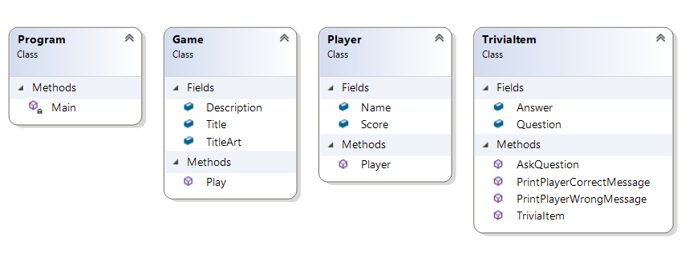
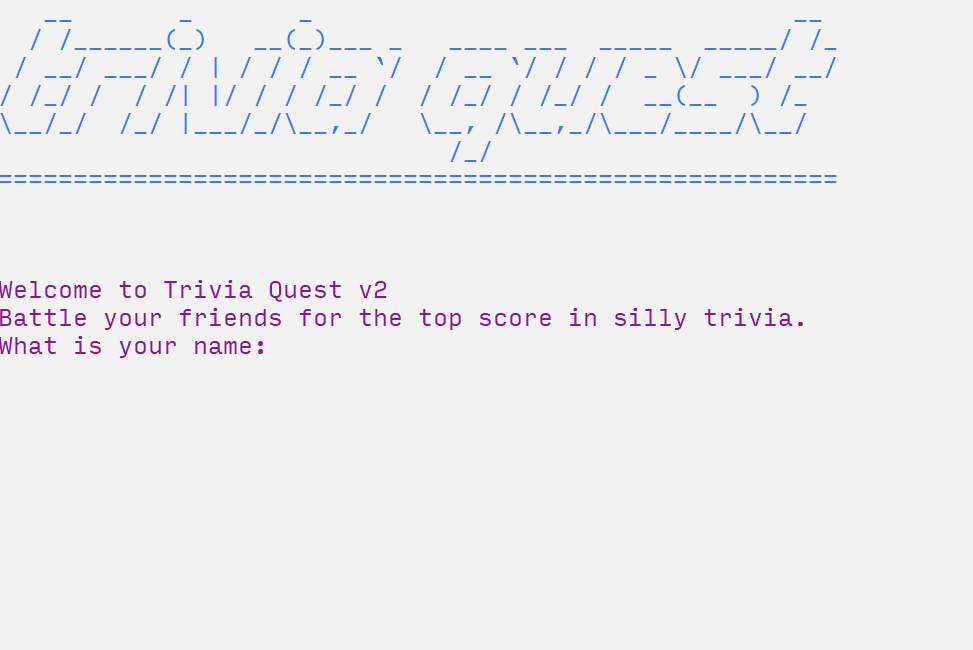

# Trivia App Breakdown

## Overview

We'll be creating a trivia application that allows a player to guess a correct answer from several possible options. This builds off of our [week 3 code](https://canvas.colum.edu/courses/12926/pages/3-dot-1-slides-and-code?module_item_id=429126). To start, we'll be using this UML (based on what we created on class).



This is what the final app will look like:



## Objective

This assignment was developed for you to practice basic C# elements:

- Statements
- Integers, Strings, Booleans
- Classes
- Constructors
- Methods
- Conditionals

## Instructions

### Project Setup

Grab the starter files from [here](https://github.com/mikewesthad/intro-to-programming-csharp/blob/master/Tutorials/Week%2004%20-%20Trivia%20App/StarterFiles.zip), or browse them online [here](./StarterFiles/) This is essentially what we ended week 3 of class having written. Review the project structure:

- The `Main` method in `Program` creates a `Game` and calls `Play`.
- The `Player` and `TriviaItem` classes just have a constructor.
- The `Play` method in `Game` creates a player and welcomes them to the game. 

### Adding Credits

Next, add a comment to the top of your project that includes the title of your app and any credits:

```cs
/*
* Trivia Application by Your Name
* Introduction to Programming, date
* (If anyone helped you - classmate, peer, stack overflow - include an attribution here!)
*/
```

### Filling Out the Game's `Play` Method

Let's revisit that `Play` method in the `Game` class. We need it to do three new things:

1. Create some trivia questions for the game.
2. Ask the questions one at a time (and adjust the player's score if they get it right).
3. When all questions are over, give the player feedback on how they did.

The `Play` method has comments with "TODO" marked where the code should go. In order to save space in the tutorial, the code that precedes the comments (getting player's name) and the code that follows the comments (thanking them for playing) are omitted.

```cs
// Game.cs

private void Play()
{
  // ...code that precedes omitted for brevity

  // Create some questions for the game.
  // TODO

  // Ask the questions one at a time. Note: we'll learn how to make this much more 
  // efficient soon!
  // TODO

  // Give the player feedback on their score.
  // TODO
  
  // ...code that follows omitted for brevity
}
```

### Creating `TriviaItem` Instances

We want to create some `TriviaItem` instances so that we can display them to the player. We can use the `TriviaItem` constructor and pass in two strings - the question itself and the correct answer. That would look something like this:

```cs
// Game.cs

private void Play()
{
  // ...code that precedes omitted for brevity

  // Create some questions for the game.
  string catQuestion = "Cats have more bones than a human does - true or false?";
  string catCorrectAnswer = "true";
  TriviaItem catTrivia = new TriviaItem(catPrompt, catCorrectAnswer);
  
  // ...code that follows omitted for brevity
}
```

Now it's your turn. Create a total of three `TriviaItem` instances - it can be random facts, trivia about your favorite show/book/movie, etc.

Run your code. What happens? Nothing new, right? We created some trivia items, but we didn't display them.

### Asking the Questions

Let's display those questions. We could do something like:

```cs
WriteLine("Question 1: " + catTrivia.Question + " ");
string catAnswer = Console.ReadLine();
if (catAnswer == catTrivia.Answer)
{
  // Bingo!
}
else
{
  // Wrong!
}
```

But then we'd have to copy and paste that code for each `TriviaItem`. This is a place where it makes sense to create a re-usable method on `TriviaItem` to consolidate the logic.

Inside of `TriviaItem`, we want to add:

```cs
public bool AskQuestion(int questionNumber)
{
    Console.Write("Question " + questionNumber + ": " + Question + " ");
    string playerAnswer = Console.ReadLine();
    if (playerAnswer.ToLower() == Answer.ToLower())
    {
        return true;
    }
    else
    {
        return false;
    }
}
```

This method asks a question and checks the player's answer in one tidy function. The first line asks the question and the second line captures the answer into a local variable. We can then do a case-insensitive comparison of the player's answer with the `TriviaItem` answer. Remember, [`ToLower`](https://docs.microsoft.com/en-us/dotnet/api/system.string.tolower?view=netframework-4.8#System_String_ToLower) is a method of the `string` class that takes a string and returns a lowercase version of it. This allows the player to answer "TRUE", "True" or "TrUE" and have it still count as the correct answer. If we convert both answers to lowercase before comparing them, then it doesn't matter which case either answer is in.

If you're feeling pretty confident with conditionals and methods, there's a much shorter way of expressing that conditional: `return playerAnswer.ToLower() == Answer.ToLower()`. But don't worry if that's too hard to follow - you can stick with the longer conditional.

Back inside of the `Play` method of `Game`, we can simply do:

```cs
bool isCatAnswerCorrect = catTrivia.AskQuestion(1);
if (isCatAnswerCorrect)
{
    // Bingo! Print out a nice, green message.
}
else
{
    // Wrong! Print out a red, message.
}
```

Hmm, before we even fill out that code, we can see that there might be some code duplication if we do this for all three questions. We can consolidate some of the logic again. Back to `TriviaItem`:

```cs
public void PrintPlayerCorrectMessage()
{
    // Store the previous foreground color, so that we can restore it after printing out a 
    // green message. 
    ConsoleColor previousColor = Console.ForegroundColor;
    Console.ForegroundColor = ConsoleColor.Green;
    Console.WriteLine("Correct! A point for you, human.");
    Console.ForegroundColor = previousColor;
}

public void PrintPlayerWrongMessage()
{
    // Store the previous foreground color, so that we can restore it after printing out a 
    // red message.
    ConsoleColor previousColor = Console.ForegroundColor;
    Console.ForegroundColor = ConsoleColor.Red;
    Console.WriteLine("Nope, try again next time.");
    Console.ForegroundColor = previousColor;
}
```

With these two methods in place, we can turn back to `Play`:

```cs
bool isCatAnswerCorrect = catTrivia.AskQuestion(1);
if (isCatAnswerCorrect)
{
    catTrivia.PrintPlayerCorrectMessage();
}
else
{
    catTrivia.PrintPlayerWrongMessage();
}
```

Now it's your turn. Make sure that your application asks all three of your trivia questions and prints out the right feedback.

### Next Steps

We'll be able to optimize our code even more once we learn a couple powerful concepts - loops and arrays - but for now, the core of the logic is done.

Do the following to finish the application:
- Add another trivia question, so that you have a total of four that the player can ask and answer.
- Track the player's score. Increase it by 1 for every question they get correct. Hint: something like `currentPlayer.Score += 1` or `currentPlayer.Score = currentPlayer.Score + 1` will both add one to the score field.
- Give the player feedback on how they did after they answer the last question. If they got everything correct, tell them they got a perfect score. If they missed one, tell them they were pretty close. If they missed more than one, tell them that they should study up and try again. Hint: you'll likely want to review our if/else if/else slides from class today.
- Make the app your own. Customize the ASCII art, title and colors to fit your own vision.

Optionally, if you want to take this further:
- What if someone types " true" or "false " by accident? You can make the user interface better by allowing the player to accidentally type spaces before or after their answer. Check out the [Trim](https://docs.microsoft.com/en-us/dotnet/api/system.string.trim?view=netframework-4.8#System_String_Trim) method on the string class for an easy way to do that.
- Try giving your trivia questions different point values, e.g. so that the player gets 3 points for getting a hard one correct and 1 point for an easy one.

### Uploading

When you've finished everything, save and close Visual Studio. Upload two things to canvas:
- A screenshot of your app running.
- A .zip archive of your project folder (see [instructions](https://canvas.colum.edu/courses/12926/pages/instructions-for-submitting-a-zipped-assignment?module_item_id=425243)).