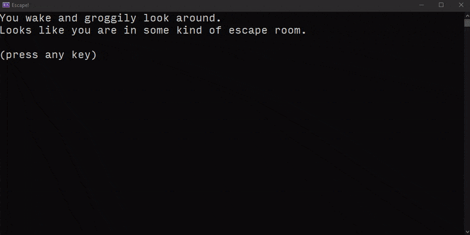
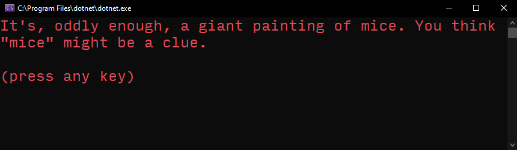

# Escape Room Breakdown

We're going to be building on our group work today, building a virtual escape room. For inspiration, check out the Avenger's cast trying an escape room [here](https://www.youtube.com/watch?v=cyWS2tcHClM) (as recommended by someone in class - sorry forgot who!). 

## Overview

You'll be creating an escape room. The player is trapped in a locked room that requires a code to escape. The player can non-linearly explore a series of objects in the room to find clues. Once the player has discovered all the clues, they should be able to use them to figure out the code to escape the room. Your finished version might look something like this:



(Or see the video version here: [Link to demo video](./Demo.mp4).)

- Your room should have three objects that the player can interact with. Keep it simple for now. For example, one object could be a piece of paper that the player can read.
- There should be a locked door (or something similar) that the player can interact with that prompts the player for a code.
- Each "move" of the game, the player should be presented with a menu of options that they can select from. For example, if I have a painting, a note and a dresser as my objects, the options might be: "What would you like to investigate? a) the painting, b) the note, c) the dresser, d) the locked door"
- The game should loop so that the player can keep exploring until they figure out the clue and escape.

## Objective

This assignment was developed for you to practice basic C# elements:

- Conditionals
- Loops
- Classes
- Constructors
- Methods

## Planning

Planning is essential to programming. Physically typing the characters in an IDE, like Visual Studio, is the easy part. Thinking through the application and coming up with an architecture that fits is the hard part. UML and flowcharts help us come up with that architecture.

So before you read through the UML and flowchart below, try creating them on your own! There are many ways to solve a problem and the way I'm showing you isn't the only way.

____

So you tried it on your own already? Without jumping ahead and reading the images below? Without jumping straight into the code? Good, I'm trusting you. 


Remember, in an object-oriented language like C# we want to divide up our project into individual classes. So in this UML we have:

- A `Door` class which is mainly responsible for keeping track of the code and giving us an `AttemptMethod()` method that prompts the player for the code returns a boolean that indicates whether they got it right or not.
- A `RoomObject` class which is mainly responsible for displaying information about the room when needed via the `DisplayInfo()` method.
- An `EscapeRoom` class that strings the whole thing together by creating `RoomObject` and `Door` instances and managing the logic for displaying the options to the player.

The flowchart of the logic might look something like:


## Instructions

Create a new project, or use your group work from class as a starting point. You'll need to create the following blank classes to get started:

- Door
- RoomObject
- EscapeRoom

### Puzzle

First things first, we'll need to design the world and the puzzle. If you've been to an escape room before, you could remix one of the puzzles you encountered. Or you could pick a theme or piece of media and design a puzzle around that. A couple examples:

- A "found words" puzzle where each clue is a word from a recognizable phrase ("three blind mice").
- A "guessing puzzle" where each clue gives you a hint about a person/thing ("she has white hair" + "she wants the iron throne" + "she's the mother of dragons" = Daenerys).

I'm going to run with "three blind mice" puzzle for this tutorial.

### RoomObject

When approaching a sizable project, you want to divide it up into small pieces that you can build and test individually - progressively working your way up to the whole thing. Let's start with the `RoomObject` class. This is a class that we can use to instantiate the three objects that will be in our room. It will need a few fields, like the name and description of the room. We'll throw in color to allow each room to display text in its own unique color:

```cs
using static System.Console;

class RoomObject
{
    string Name;
    string Description;
    ConsoleColor Color;
}
```

Note: all these fields are _private_ when we don't give them an explicit access modifier. Private means they can only be accessed within the class. As a general rule, we want to make as many field private to limit which parts of our codebase can manipulate them.

Almost any time you create a class that you plan to instantiate (e.g. non-static), you'll want a constructor to make it easy to create instances:

```cs
public RoomObject(string name, string description, ConsoleColor color)
{
    Name = name;
    Description = description;
    Color = color;
}
```

Then we'll want a _public_ method to display the information about the object to the player when they decide to interact with it:

```cs
public void DisplayInfo()
{
    ForegroundColor = Color;
    WriteLine("You inspect the " + Name + ".");
    WriteLine(Description);
    Write("\n(press any key) ");
    ReadKey(true); // The "true" argument here prevents the key that is typed from displaying
}
```

Time to check if it's working. Create an instance of it inside of you `Main` function and try the `DisplayInfo` method.

```cs
RoomObject Painting = new RoomObject("painting", 
    "It's, oddly enough, a giant painting of mice. You think \"mice\" might be a clue.", 
    ConsoleColor.Red);
Painting.DisplayInfo();
```



Create your two other objects and test out displaying them.

## EscapeRoom

Next up, let's tackle the skeleton for the `EscapeRoom` class. That's going to be the workhorse of the app. To keep things simple, let's display the three room objects to the player once and let them choose which to explore. We won't worry about looping so that they can explore multiple rooms, and we won't worry about the door.

Inside `EscapeRoom`, we'll need our three `RoomObject` instances and a way to start the room running:

```cs
class EscapeRoom
{
    RoomObject Painting;
    RoomObject DeskDrawer;
    RoomObject Cane;

    public EscapeRoom()
    {
        Painting = new RoomObject("painting", "It's, oddly enough, a giant painting of mice. You think \"mice\" might be a clue.", ConsoleColor.Red);
        DeskDrawer = new RoomObject("desk drawer", "It sticks slightly, but you manage to jiggle the drawer open. You find a post-it with the number \"three\" on it.", ConsoleColor.Blue);
        Cane = new RoomObject("cane", "You realize it is actually a walking stick that a \"blind\" person might use.", ConsoleColor.Yellow);
    }
    
    public void StartRoom()
    {
        // TODO
    }
}
```

We can get everything running by clearing out the old code we had inside of `Main` and then adding:

```cs
EscapeRoom room = new EscapeRoom();
room.StartRoom();
```

Nothing interesting happens when we run yet because we didn't implement `StartRoom`. Before reading the code below, try implementing the conditional logic yourself - display the choices to the player and let them decide which they want to explore.

```cs
public void StartRoom()
{
    ForegroundColor = ConsoleColor.White;
    WriteLine("Where would you like to look?");
    WriteLine("  1) a painting\n  2) a desk drawer\n  3) a cane\n  4) a door");
    string choice = ReadLine();

    if (choice == "1")
    {
        Painting.DisplayInfo();
    }
    else if (choice == "2")
    {
        DeskDrawer.DisplayInfo();
    }
    else if (choice == "3")
    {
        Cane.DisplayInfo();
    }
}
```

And if all goes well, you should be able to play it and make one decision.

## Looping

Now, we just need to sprinkle in a loop to give the player the ability to explore the objects as many times as they want. What would be a good loop structure for this?

A _for loop_ wouldn't make sense because we aren't trying to iterate a known number of times. That leaves us with a _while loop_ or a _do while loop_. The latter is a good fit because we want to run the loop body at least once.

```cs
public void StartRoom()
{
    bool hasEscaped = false;

    do {
        ForegroundColor = ConsoleColor.White;
        WriteLine("Where would you like to look?");
        WriteLine("  1) a painting\n  2) a desk drawer\n  3) a cane\n  4) a door");
        string choice = ReadLine();

        if (choice == "1")
        {
            Painting.DisplayInfo();
        }
        else if (choice == "2")
        {
            DeskDrawer.DisplayInfo();
        }
        else if (choice == "3")
        {
            Cane.DisplayInfo();
        }
        else if (choice == "4")
        {
            // For now, we can just let the player leave without solving the code.
            hasEscaped = true;
        }
    } while (!hasEscaped);

    WriteLine("You escaped!");
    WriteLine("Thanks for playing.\nPress any key to exit...");
    ReadKey();
}
```

Test it out. You should be able to explore all your rooms and immediately escape if you choose the door.

## Finishing Up

- Make sure you have at least 3x objects in your room that the player can explore. They can be anything you want - the only constraint is that they be something different than this tutorial.
- Add an introduction before the loop starts.
- Change the console title.
- What happens if they don't choose a valid option? Give them some feedback when that happens.
- Add in the `Door` class and get the code logic working. Review the flowchart and UML if you get lost. To be kind to the player, try making the code case-insensitive.
- Add in your own ASCII and color design.
- (Optional, but recommended) track the number of seconds it takes the player to escape and print that out. You'll want the [Systems.Diagnostics.Stopwatch](https://docs.microsoft.com/en-us/dotnet/api/system.diagnostics.stopwatch?view=netframework-4.8). Reading documentation is a skill that requires practice. Check out the examples, then look through the fields, properties and methods to see if you can figure out what you would need. You won't understand everything you see the first time you read it.

### Uploading

When you've finished everything, save and close Visual Studio. Upload two things to canvas:
- A screenshot of your app running.
- A .zip archive of your project folder (see [instructions](https://canvas.colum.edu/courses/12926/pages/instructions-for-submitting-a-zipped-assignment?module_item_id=425243)).